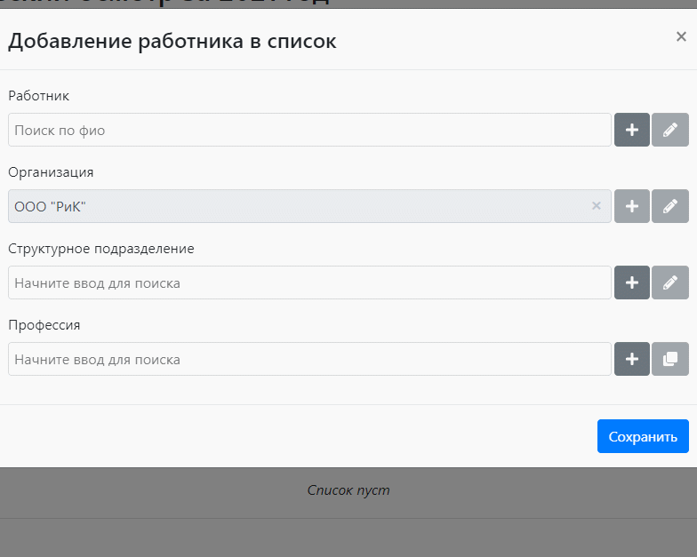

# ProfOsmotr
*Этот проект выполнен в рамках самостоятельного обучения. В учебных целях, решение некоторых задач могло быть избыточным для ситуации, либо, наоборот, упрощенным.*

Данное решение предназначено для работы с медицинскими осмотрами, проводимыми в отношении определенных категорий работников, в соответствии с приказом Минздрава России от 28.01.2021 N 29н. В проекте реализована возможность использования предоставляемого функционала несколькими медицинскими организациями раздельно, а также несколькими пользователями в рамках организации.
## Возможности:
* расчет состава, количества и стоимости медицинских услуг, необходимых для проведения медицинского осмотра, в соответствии с приказом № 29н (для одного человека или соответствующего контингента);
* настройка стоимости и доступности медицинских услуг в рамках медицинской организации;
* заполнение базы данных исходными данными о необходимых для проведения осмотра обследованиях, в соответствии с приказом 29н;
* внесение изменений в порядок расчета медицинских осмотров в случае корректировок нормативной базы;
* многопользовательский доступ с базовым разделенем по ролям;
* управление подключением медицинских организаций к работе с сервисом;
* [автоматизированное рабочее место оператора медицинской комиссии](#operator-wp).

Проект выполнен на базе .NET Core 3.1. Также использовались следующие пакеты:
* AutoMapper;
* EntityFrameworkCore (для упрощения развертывания использовалась СУБД SQLite);
* xUnit;
* Moq;
* TemplateEngine.Docx;
* Swashbuckle.AspNetCore.

Для улучшения пользовательского опыта и уменьшения потребности в перезагрузке страниц клиентская часть дополнена JavaScript.

## АРМ Оператора
Реализует информационную поддержку проведению предварительных и периодических медосмотров работников, а именно:
* учет пациентов медицинской организации, проходящих медицинские осмотры;
* учет организаций-работодателей, направляющих работников на медицинские осмотры;
* учет результатов медосмотров работников: для каждого из видов медосмотров учитываются характеристика места работы, результаты обследований, результаты медосмотра;
* для периодических медосмотров организован учет консолидированных данных: численности работников по категориям, список контингента, подлежащего медосмотру;
* подготовка документов и отчетов в формате .docx: медицинское заключение по результатам медосмотра, выписка из амбулаторной карты, заключительный акт и годовой отчет по результатам периодических осмотров.

Клиентская часть реализована с использованием React + MobX.

*При добавлении работника в список периодического медосмотра, форма подсказывает, если ⭐ пациент или ⭐ профессия участвовали в предыдущих медосмотрах данного работодателя.*

Другие скриншоты: [1](docs/images/employer.png), [2](docs/images/periodic.png), [3](docs/images/checkup.png).
